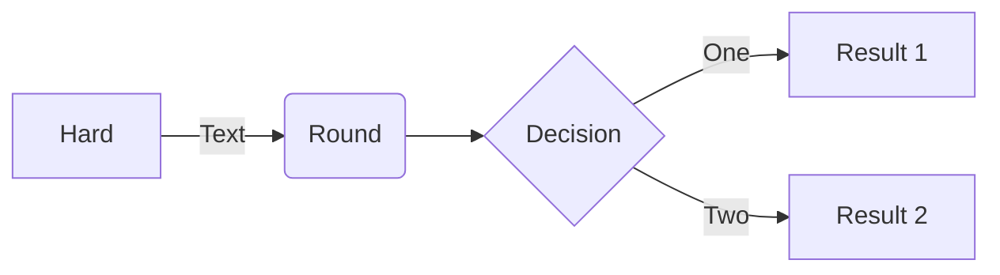

# What is Model checking?

Brief overview [here](https://www.cs.cmu.edu/~aldrich/courses/654-sp05/handouts/model-checking-3.pdf). 

TL;DR 
> Model checking is an influential method to verify complex interactions, concurrent and distributed systems.

# Formal specification language

One of the formal specification languages is **TLA+**. 
You could find additional information in these links ([lamport-tla](https://lamport.azurewebsites.net/tla/tla.html), [learn-tla](https://learntla.com/)).